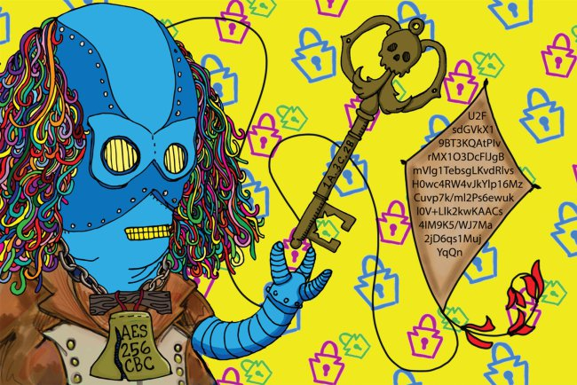

# crypto_challenge
Repository for the Philly BSides yearly crypto challenges. 

## Hints
- For all challenge answers are lowercase.
- Remember to remove new lines when checking checksums!

## Challenges
| Year    | Link                | Description |
|---------|---------------------|-------------|
| 2017    |[Innagural]("challenges/2017.md")          | Take a stab at the first even appearance of Robo Ben Franklin's Crypto challenge. |
| 2018/19 |[Pirate Ben Returns]("challenges/2019.md") | Robo Ben is back with his pirate army trying to foil mutiny! |


## 2


Robo BennieF is back this year with his robot pirate army. He looks over the bow, as a white whale breaches the surface and with a blast of sea water, launches a book into the air. He wipes the liquid from his sensors to find a watterlogged copy of 20,000 Leagues grasped between his servos.
```
aHR0cHM6Ly93d3cuZ3V0ZW5iZXJnLm9yZy9maWxlcy8xNjQvMTY0LWgvMTY0LWguaHRt
```

*1a.* He glances over the soaking cover, it reads, "Twenty Thousand Leagues Under 0xAAA Sea by Jules Verne" 
```
checksum: 8fc42c6ddf9966db3b09e84365034357
```

*2b.* Opening the book, he finds an inscription: "Major André, ptIchVIIpa26l5w11 -RoboBenedict" What a treacherous message. 
```
checksum: b2fdab230a2c39f3595a947861863cb7
```

*3c.* With the previous clue deciphered, at the bottom of the page, he notices another note "Give me liberfy ir give me death" in the footer.  What a peculiar thing to write?
```
checksum: 01b6e20344b68835c5ed1ddedf20d531
```

*4d.* Quickly flipping through the pages, he discovers a note in the margin of a page: "Turn to the penultimate chapter and read about the 4 directions, where 17 bots ventured, through 24 islands for 46 nights and 47 days to find 66 barrels filled with robo-joint grease #71 in the resting place of Captain N." 
```
checksum: dd76967b79afecfefcc8e2d9452b380f
```

5e. Frustrated by these nonsensical messages, RoboBen shakes the book. It becomes unbound and he discovers the text `4d3c1a2b` inscribed into the spine.

### Graphic Flag Text (image)
```
U2FsdGVkX1+fasreO2RguIfwO0Dw2qY4kypjAommfKzK3xhXvP+BOPfB4GnlCKz12wnMFbuE+G8EHlc3H2y8UusGiShJHD3LxOPebR9Ktm5RdF/o6UjEZ+NlL7LRJQKZrmZ0f+Lg7Pv3NAi6tqBwPA==
```

### Final Flag
echo "FLAG_JAWN" | openssl ALGO_JAWN -a -A -k 5e -iv 00010203040506070809a0b0c0d0e0f -d

## 1


Info: Welcome to the first Philly BSides Crypto Challenge held on December 8th, 2017. Being the first year we wanted to have something fun and quick during our short day. There is a series of cryptograms which get more difficult and will be needed to decipher the final flag (kite... get it!).

*1a.* orawnzva senaxyva bapr pbzcnerq gur onyq rntyr gb n ihygher fvapr gurl jrer bsgra frra srrqvat ba pneevba jung glcr bs oveq qvq ora jnag nf gur angvbany oveq

*2b.* rgvx fvu lys aro qvq enrl gnuj av tavagutvy sb rehgna ynpvegpryr rug tavgnegfabzrq tavagutvy lo xphegf aruj enw arqlry n av rtenup n qrgpryybp qan zebgferqahug n tavehq rgvx n jrys avyxanes avznwaro

*3c.* 72 70 61 6E 67 66 76 71 20 6E 20 67 6E 20 71 61 6E 20 72 66 62 79 70 20 63 68 20 74 61 76 72 72 66 20 65 62 73 20 72 70 76 69 72 71 20 66 76 75 67 20 71 72 67 61 72 69 61 76 20 61 76 79 78 61 6E 65 73 20 61 76 7A 6E 77 61 72 6F 20 66 72 66 66 6E 79 74 20 74 61 76 71 6E 72 65 20 73 62 20 66 65 76 6E 63 20 62 6A 67 20 61 72 72 6A 67 72 6F 20 74 61 76 75 70 67 76 6A 66 20 73 62 20 71 72 65 76 67 

### Final Flag
4d. echo "KITE_JAWN" | openssl enc ALGO_JAWN -a -A -k KEY_JAWN -iv 000102030405060708090a0b0c0d0e0f -d
