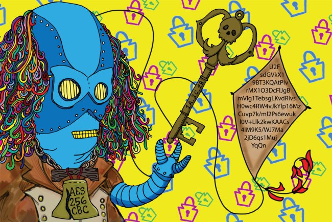

#2017

Info: Welcome to the first Philly BSides Crypto Challenge held on December 8th, 2017. Being the first year we wanted to have something fun and quick during our short day. There is a series of cryptograms which get more difficult and will be needed to decipher the final flag (kite... get it!).

*1a.* orawnzva senaxyva bapr pbzcnerq gur onyq rntyr gb n ihygher fvapr gurl jrer bsgra frra srrqvat ba pneevba jung glcr bs oveq qvq ora jnag nf gur angvbany oveq

*2b.* rgvx fvu lys aro qvq enrl gnuj av tavagutvy sb rehgna ynpvegpryr rug tavgnegfabzrq tavagutvy lo xphegf aruj enw arqlry n av rtenup n qrgpryybp qan zebgferqahug n tavehq rgvx n jrys avyxanes avznwaro

*3c.* 72 70 61 6E 67 66 76 71 20 6E 20 67 6E 20 71 61 6E 20 72 66 62 79 70 20 63 68 20 74 61 76 72 72 66 20 65 62 73 20 72 70 76 69 72 71 20 66 76 75 67 20 71 72 67 61 72 69 61 76 20 61 76 79 78 61 6E 65 73 20 61 76 7A 6E 77 61 72 6F 20 66 72 66 66 6E 79 74 20 74 61 76 71 6E 72 65 20 73 62 20 66 65 76 6E 63 20 62 6A 67 20 61 72 72 6A 67 72 6F 20 74 61 76 75 70 67 76 6A 66 20 73 62 20 71 72 65 76 67 

### Final Flag
4d. echo "KITE_JAWN" | openssl enc ALGO_JAWN -a -A -k KEY_JAWN -iv 000102030405060708090a0b0c0d0e0f -d
